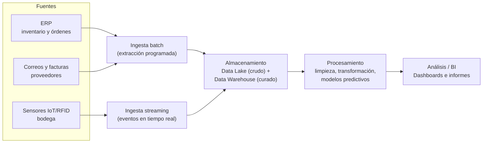

<!--
CONFIG
FULL_NAME: Juan Pablo Ortega Vargas
GITHUB_USER: Ju4n-0rtega
-->

# Actividad Práctica · Semana 3 — Diseña una arquitectura de datos

**Modalidad:** Individual
**Tipo:** Formativa (opcional, sin nota)
**Caso:** Logística y gestión de inventarios de materias primas en una empresa industrial

---

## 1. Arquitectura de datos: fuentes → ingesta → almacenamiento → procesamiento → análisis/BI

**Flujo explicado:** los datos estructurados del ERP y semiestructurados de correos/facturas se cargan por lotes (batch) de forma programada, mientras que los eventos de los sensores IoT/RFID llegan en flujo continuo (streaming). Todo converge en una capa de almacenamiento combinada, luego se procesa y limpia, y finalmente alimenta los dashboards de negocio.

---

## 2. ¿Data lake o warehouse? ¿Batch o streaming?

### Data lake + Data warehouse (enfoque híbrido)

Se recomienda un **data lake** como capa base, porque el caso maneja una alta **variedad** de datos: estructurados (inventario, ventas), semiestructurados (logs de sensores, facturas) y no estructurados (correos, fotos de productos dañados). Un data warehouse tradicional exige un esquema fijo desde el inicio, lo cual no es adecuado para datos no estructurados.

Sin embargo, para las tablas que sí alimentan los dashboards de negocio (niveles de inventario, ventas, pronósticos), conviene tener también un **data warehouse** con datos ya limpios y modelados, porque ofrece consultas más rápidas y confiables para reportes recurrentes. Por eso se propone un enfoque combinado tipo "lakehouse": todo entra primero al lake, y lo relevante para BI se cura hacia el warehouse.

### Batch y streaming (enfoque híbrido)

- **Batch:** adecuado para el historial de ventas, órdenes de producción y facturas, ya que estos datos se analizan para tendencias y pronósticos que no requieren actualización segundo a segundo (por ejemplo, una carga diaria o semanal es suficiente).
- **Streaming:** necesario para los sensores IoT/RFID de la bodega, porque se requiere detectar en tiempo real cuándo un producto llega a un nivel crítico de inventario o cuándo ocurre un movimiento inusual.

---

## 3. Herramienta candidata por etapa

| Etapa | Herramienta candidata | Por qué |
|-------|------------------------|---------|
| Ingesta | Apache Kafka (streaming) + Apache Airflow (batch) | Kafka permite capturar los eventos de los sensores IoT en tiempo real con baja latencia; Airflow permite programar y orquestar las extracciones periódicas desde el ERP y otras fuentes batch. |
| Procesamiento | Apache Spark | Puede procesar tanto datos por lotes como en streaming (streaming estructurado), lo que encaja con el enfoque híbrido batch/streaming del caso, y escala bien con grandes volúmenes de datos. |
| Análisis / BI | Power BI | Es una herramienta ampliamente usada en entornos empresariales, se conecta fácilmente a un data warehouse, y permite crear dashboards de inventario y alertas comprensibles para el área de compras y logística sin requerir conocimientos técnicos avanzados. |
