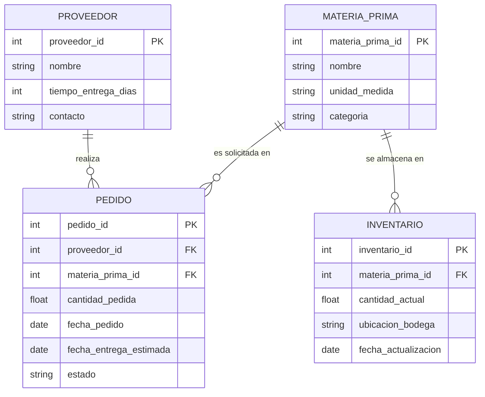

<!--
CONFIG
FULL_NAME: Juan Pablo Ortega Vargas
GITHUB_USER: Ju4n-0rtega
-->

# Actividad Calificable · Corte 2 — Modelo, consulta y limpieza de datos (Enlace: **Repositorio GitHub:** https://github.com/Ju4n-0rtega/electiva-vi-ciencia-datos-2026-b-g1/tree/main/09-week/actividad-c2)

**Caso:** Logística y gestión de inventarios de materias primas en una empresa industrial (continuación del caso trabajado en el Corte 1).

---

## 1. Modelo entidad-relación (ERD)

Se identificaron 4 entidades del caso: **Proveedor**, **MateriaPrima**, **Inventario** y **Pedido**.



**Cardinalidades:**
- Un **Proveedor** puede realizar muchos **Pedidos**, pero cada Pedido pertenece a un único Proveedor (1 : N).
- Una **MateriaPrima** puede aparecer en muchos **Pedidos** (1 : N).
- Una **MateriaPrima** puede tener muchos registros de **Inventario** (por ejemplo, en distintas bodegas) (1 : N).

---

## 2. Dataset y limpieza con Python (pandas)

**Dataset:** `pedidos_materia_prima.csv`, un conjunto de 49 pedidos de materias primas a 4 proveedores distintos (Acero del Sur, Insumos Andinos, Química Industrial SAS, Textiles del Huila), generado para simular datos reales "sucios": nombres de proveedores y estados con mayúsculas/minúsculas inconsistentes, cantidades con unidades mezcladas en el texto (ej. "150 kg"), fechas en tres formatos distintos, valores nulos y filas duplicadas.

### Código de limpieza (`limpieza.py`)

```python
import pandas as pd
import numpy as np

df = pd.read_csv("pedidos_materia_prima.csv", dtype=str)

# 1) Quitar duplicados exactos
df = df.drop_duplicates()

# 2) Normalizar texto: proveedor y estado a formato consistente (Title Case)
df['proveedor'] = df['proveedor'].str.strip().str.title()
df['estado'] = df['estado'].str.strip().str.title()

# 3) Limpiar cantidad_pedida: quitar unidades de texto y convertir a número
df['cantidad_pedida'] = (
    df['cantidad_pedida']
    .str.replace(r'[a-zA-Záéíóú]+', '', regex=True)
    .str.strip()
)
df['cantidad_pedida'] = pd.to_numeric(df['cantidad_pedida'], errors='coerce')

# 4) Normalizar fechas (varios formatos) a un único tipo datetime
def parse_fecha(x):
    if pd.isna(x) or x == "":
        return pd.NaT
    for fmt in ("%Y-%m-%d", "%d/%m/%Y", "%d-%b-%Y"):
        try:
            return pd.to_datetime(x, format=fmt)
        except ValueError:
            continue
    return pd.NaT

df['fecha_pedido'] = df['fecha_pedido'].apply(parse_fecha)
df['fecha_entrega_estimada'] = df['fecha_entrega_estimada'].apply(parse_fecha)

# 5) Nulos en cantidad_pedida (dato crítico) -> se eliminan esas filas
df = df.dropna(subset=['cantidad_pedida'])

# 6) Nulos en fecha_entrega_estimada -> se imputan con la mediana de días
#    de entrega de ese mismo proveedor
df['dias_entrega'] = (df['fecha_entrega_estimada'] - df['fecha_pedido']).dt.days
mediana_dias_por_proveedor = df.groupby('proveedor')['dias_entrega'].median()

def imputar_fecha_entrega(row):
    if pd.isna(row['fecha_entrega_estimada']) and not pd.isna(row['fecha_pedido']):
        mediana = mediana_dias_por_proveedor.get(row['proveedor'], np.nan)
        if not pd.isna(mediana):
            return row['fecha_pedido'] + pd.Timedelta(days=mediana)
    return row['fecha_entrega_estimada']

df['fecha_entrega_estimada'] = df.apply(imputar_fecha_entrega, axis=1)
df['dias_entrega'] = (df['fecha_entrega_estimada'] - df['fecha_pedido']).dt.days

df.to_csv("pedidos_materia_prima_limpio.csv", index=False)
```

### Reporte antes / después

| Métrica | Antes | Después |
|---|---|---|
| Filas totales | 49 | 42 |
| Filas duplicadas | 4 | 0 |
| Nulos en `cantidad_pedida` | 5 | 0 (filas eliminadas: 3 — las otras 2 estaban en filas duplicadas que ya se habían quitado) |
| Nulos en `fecha_entrega_estimada` | 6 | 0 (imputados con la mediana de días de entrega por proveedor) |
| Tipo de `cantidad_pedida` | texto (mezclado con unidades) | `float64` |
| Tipo de fechas | texto, 3 formatos distintos | `datetime64` |
| Valores distintos de `proveedor` | 12 (por mayúsculas/minúsculas) | 4 (normalizados) |
| Valores distintos de `estado` | 9 (por mayúsculas/minúsculas) | 3 (normalizados) |

**Decisiones de limpieza y por qué:**
- Las filas con `cantidad_pedida` nula se **eliminaron** en lugar de imputarse, porque es el dato central del análisis (no tiene sentido inventar cuánto se pidió).
- Las fechas de entrega nulas se **imputaron** con la mediana de días de entrega de ese mismo proveedor, porque sí se puede estimar razonablemente a partir del comportamiento histórico del proveedor, y perder esas filas habría reducido aún más el dataset.
- Los duplicados exactos se eliminaron por completo, ya que representaban el mismo pedido registrado dos veces.

---

## 3. Dos preguntas respondidas con consultas (pandas: filtro + agregación)

### Pregunta 1 — ¿Qué proveedor tiene el mayor tiempo promedio de entrega?

```python
df.groupby("proveedor")["dias_entrega"].mean().round(1).sort_values(ascending=False)
```

**Resultado:**

| Proveedor | Días promedio de entrega |
|---|---|
| Química Industrial Sas | 15.8 |
| Acero Del Sur | 12.3 |
| Textiles Del Huila | 8.1 |
| Insumos Andinos | 5.3 |

**Hallazgo:** Química Industrial SAS es, por bastante margen, el proveedor más lento (casi 3 veces más que Insumos Andinos). Esto sugiere que las materias primas que dependen de ese proveedor deberían pedirse con más anticipación para evitar desabastecimiento.

### Pregunta 2 — ¿Cuál es la materia prima con mayor cantidad total pedida entre los pedidos ya "Entregado"?

```python
entregados = df[df["estado"] == "Entregado"]
entregados.groupby("materia_prima")["cantidad_pedida"].sum().round(1).sort_values(ascending=False)
```

**Resultado:**

| Materia prima | Cantidad total entregada |
|---|---|
| Acero laminado | 1106.0 |
| Cable de cobre | 1073.5 |
| Tinte textil | 1034.4 |
| Algodón crudo | 595.3 |
| Resina plástica | 430.6 |

**Hallazgo:** el acero laminado y el cable de cobre concentran la mayor parte del volumen ya recibido, lo que indica que son las materias primas de mayor rotación en este conjunto de datos y, por lo tanto, las que más impacto tendrían en los costos de almacenamiento si se sobre-pide.

---

## Data & cleaning (English section)

This activity uses a synthetic dataset of 49 raw-material purchase orders from four suppliers, representing the inventory logistics case used throughout this course. The raw data included inconsistent supplier and status names (mixed uppercase and lowercase), quantities written with units as text, dates in three different formats, missing values, and duplicate rows. Using pandas, we removed exact duplicates, standardized text fields to a consistent format, converted quantities to numeric values, parsed all dates into a proper datetime type, dropped rows with a missing order quantity, and imputed missing delivery dates using each supplier's median lead time. After cleaning, the dataset went from 49 to 42 valid rows with no remaining nulls or duplicates. We then answered two questions: which supplier has the longest average delivery time, and which raw material has the highest total delivered quantity, both using pandas filtering and aggregation (groupby).
